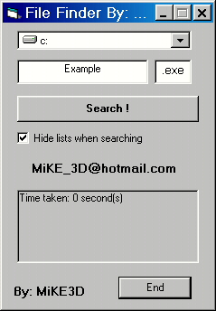



## Search for file\(s\) on a Drive with API

### Description

My coding actually does several things. The main thing is that it can search an entire Drive and all of its Directories for a file you specify and at the end of the search display the results of it. Or you can do the same thing but this time look for any file with an extention you specify. I made this search for the file using API but I left a function in there you can edit to search for the files without API but it's a little slower and not recommended. This Screen Shot can pretty much explain it all...   E-mail: mikecanejo@hotmail.com AIM: Mike3dd
 
### More Info
 

             |
---                |---
**Submitted On**   |2000-04-02 01:11:02
**By**             |[Michael L\. Canejo](https://github.com/Planet-Source-Code/PSCIndex/blob/master/ByAuthor/michael-l-canejo.md)
**Level**          |Intermediate
**User Rating**    |4.7 (75 globes from 16 users)
**Compatibility**  |VB 4\.0 \(32\-bit\), VB 5\.0, VB 6\.0
**Category**       |[Files/ File Controls/ Input/ Output](https://github.com/Planet-Source-Code/PSCIndex/blob/master/ByCategory/files-file-controls-input-output__1-3.md)
**World**          |[Visual Basic](https://github.com/Planet-Source-Code/PSCIndex/blob/master/ByWorld/visual-basic.md)
**Archive File**   |[CODE\_UPLOAD4466422000\.zip](https://github.com/Planet-Source-Code/michael-l-canejo-search-for-file-s-on-a-drive-with-api__1-6943/archive/master.zip)

